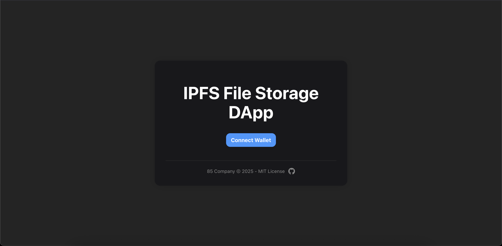
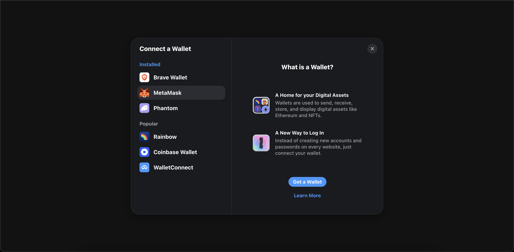
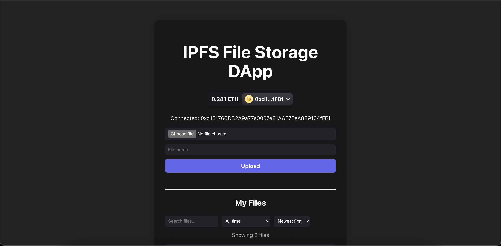
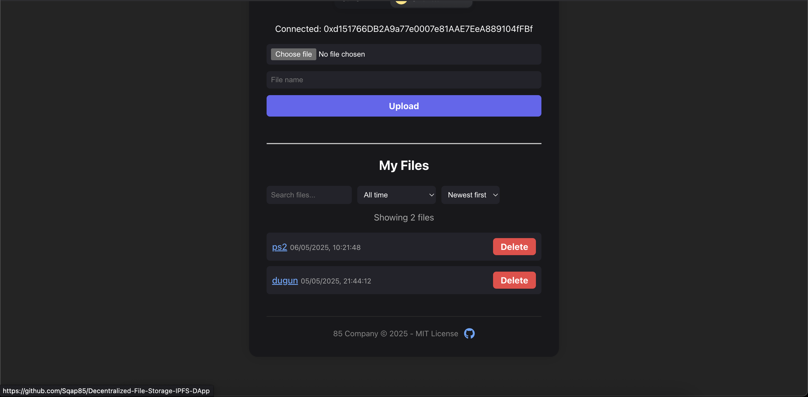

<div align="center">
  <h1>📁 IPFS File Storage DApp</h1>
  <p>Decentralized file storage application developed with React + Ethers.js + RainbowKit + IPFS + Solidity + Foundry</p>
</div>

---

## 🌍 English

### 🔍 App Overview

This decentralized application (DApp) allows users to upload files to IPFS and store the file hash on the Ethereum blockchain, ensuring permanent and secure access.

### 🔧 Features

1. 💳 Connect wallet (MetaMask, WalletConnect)
2. 📂 Select a file and provide a name
3. 🚀 Upload to IPFS and store hash on the blockchain
4. 📜 List all uploaded files by the user
5. 🗑️ Delete files if desired
   <div style="border: 1px solid #d1ecf1; background-color: #e9f7fa; padding: 16px; border-radius: 8px; margin-top: 32px;">
   <h3>ℹ️ Notice</h3>
  <p>This application uploads files to IPFS <strong>without encryption</strong>, and the data on IPFS is <strong>publicly accessible</strong>.</p>
  <p>The purpose of the app is to <strong>store publicly shareable documents in a decentralized and permanent way</strong>.</p>
  <p>Therefore, please only upload content that is <em>safe for public access</em>.</p>
</div>

---

## ⚙️ IPFS Node Requirement

To upload files, an IPFS node must be running locally.

### Start IPFS Node:

1. Install IPFS CLI: [https://docs.ipfs.tech/install/](https://docs.ipfs.tech/install/)
2. In terminal, run:

```bash
ipfs init
ipfs daemon
```

Once started, the app can interact with IPFS to store files.

---

## 📜 Smart Contract: IPFSStorage.sol

<p>To view the contract on the Ethereum testnet, visit: <a href="https://sepolia.etherscan.io/address/0xcf5Df6513F267192c6bEB5A3a5f29FB6FcFB7b41#code" target="_blank">IPFSStorage.sol Contract - Sepolia Testnet</a></p>

This smart contract lets users store, retrieve, and delete their own file hashes on Ethereum.

### 🧱 Structure: `FileInfo`

- `ipfsHash`: Hash of the file stored in IPFS
- `name`: User-defined file name
- `timestamp`: Timestamp of when file was added

### 🛠️ Functions

- `addFile(string ipfsHash, string name)` → Adds new file (no duplicates for same user)
- `getMyFiles()` → Lists all of user's files
- `getMyFile(uint256 index)` → Returns file at index
- `getMyFileCount()` → Returns file count
- `deleteMyFile(uint256 index)` → Deletes file by replacing with last

### 📢 Events

- `FileAdded`
- `FileDeleted`

### 🔐 Security

- Empty or duplicate IPFS hashes are not allowed
- Users can only access and delete their own files

---

## 🖼️ Screenshots

### Connect Wallet


### Wallet Modal


### Main Screen After Connect


### File List


---

## 🌐 Türkçe

### 🔍 Uygulamanın Genel İşlevi

Bu DApp, kullanıcıların dosyalarını IPFS'ye yükleyip, hash'lerini Ethereum blockchain üzerine kaydetmelerine olanak tanır. Böylece dosyalar merkeziyetsiz bir ortamda güvenle saklanabilir ve erişilebilir olur.

### 🔧 Özellikler

1. 💳 Cüzdan bağlantısı (MetaMask, WalletConnect) yapılır.
2. 📂 Dosya seçilir ve bir isim girilir.
3. 🚀 Dosya IPFS'ye yüklenir ve hash kontrata kaydedilir.
4. 📜 Kullanıcının yüklediği dosyalar listelenir.
5. 🗑️ Kullanıcı dosyaları silme işlemi gerçekleştirebilir.
<div style="border: 1px solid #f5c518; background-color: #fff3cd; padding: 16px; border-radius: 8px; margin-top: 32px;">
  <h3>ℹ️ Bilgilendirme</h3>
  <p>Bu uygulama, dosyaları IPFS üzerine şifreleme yapmadan yükler ve IPFS üzerindeki veriler <strong>herkese açık</strong> olarak saklanır.</p>
  <p>Uygulamanın amacı, <strong>genel olarak paylaşılmak istenen belgeleri merkeziyetsiz ve kalıcı bir şekilde depolamaktır</strong>.</p>
  <p>Bu nedenle, yalnızca <em>herkesin erişimine açık olmasında sakınca olmayan içerikler</em> yüklenmelidir.</p>
</div>
  
---

## ⚙️ IPFS Node Gereksinimi

Bu uygulamanın çalışması için yerel bir IPFS node'u çalıştırmanız gerekir:

### IPFS Node Nasıl Başlatılır?

1. IPFS CLI kurulum: [https://docs.ipfs.tech/install/](https://docs.ipfs.tech/install/)
2. Terminalde sırasıyla şunları çalıştırın:

```bash
ipfs init
ipfs daemon
```

Node başladıktan sonra IPFS ile dosya yükleme işlemleri yapılabilir.
  
---

## 📜 Akıllı Kontrat (IPFSStorage.sol) Açıklaması

<p>Kontrata Ethereum testnet üzerinden erişmek için aşağıdaki adrese göz atabilirsiniz: <a href="https://sepolia.etherscan.io/address/0xcf5Df6513F267192c6bEB5A3a5f29FB6FcFB7b41#code" target="_blank">IPFSStorage.sol Kontratı - Sepolia Testnet</a></p>

Bu kontrat, kullanıcıların dosyalarını Ethereum blockchain üzerinde yönetebilmesini sağlar.

### 🧱 Yapı: `FileInfo`

- `ipfsHash` → Dosyanın IPFS üzerindeki hash değeri
- `name` → Dosya ismi
- `timestamp` → Eklenme zamanı

### 🛠️ Fonksiyonlar

- `addFile(string ipfsHash, string name)` → Yeni dosya ekler (aynı hash'ten bir tane olabilir).
- `getMyFiles()` → Kullanıcının yüklediği tüm dosyaları listeler.
- `getMyFile(uint256 index)` → Belirli bir dosyayı döner.
- `getMyFileCount()` → Kullanıcının dosya sayısını verir.
- `deleteMyFile(uint256 index)` → Belirli dosyayı siler.

### 📢 Events

- `FileAdded` → Dosya eklendiğinde tetiklenir.
- `FileDeleted` → Dosya silindiğinde tetiklenir.

### 🔐 Güvenlik

- Aynı kullanıcı aynı hash'i birden fazla ekleyemez.
- Kullanıcı yalnızca kendi dosyalarına erişebilir ve silebilir.

---

<div align="center"> <p><strong>🔓</strong></p> <p><strong>“A world in which everyone has access to information without gatekeepers is a freer world.”</strong></p> <p>— David Chaum</p> </div>
